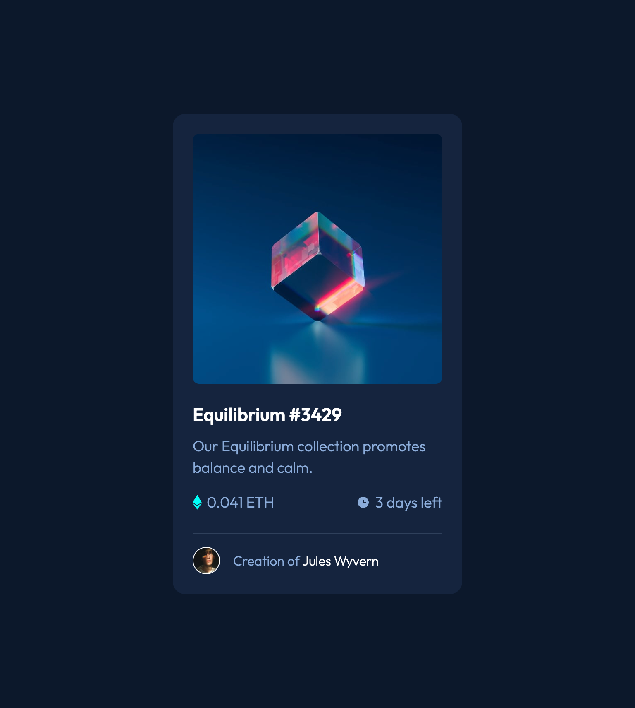

# Frontend Mentor - NFT preview card component solution

This is a solution to the [NFT preview card component challenge on Frontend Mentor](https://www.frontendmentor.io/challenges/nft-preview-card-component-SbdUL_w0U). Frontend Mentor challenges help you improve your coding skills by building realistic projects.

## Table of contents

- [Overview](#overview)
  - [The challenge](#the-challenge)
  - [Screenshot](#screenshot)
  - [Links](#links)
- [My process](#my-process)
  - [Built with](#built-with)
  - [What I learned](#what-i-learned)
- [Author](#author)

**Note: Delete this note and update the table of contents based on what sections you keep.**

## Overview

### The challenge

Users should be able to:

- View the optimal layout depending on their device's screen size
- See hover states for interactive elements

### Screenshot

### Links

- 🤓 [Solution URL:](https://frontendstu.github.io/nft-preview-card-component/)
- 🌐 [Live Site URL:](https://github.com/frontendstu/nft-preview-card-component/)

## My process

### Built with

- Semantic HTML5 markup
- CSS custom properties
- Flexbox

### What I Learned

This was a fun little project. It was cool because I discovered the `inset` rule. The `inset` rule is the shorthand property instead of using `top`, `right`, `bottom` and `left`.

I had some problems with the hover effect of the NFT image, I did some research and found a good example on [W3 Schools](https://www.w3schools.com/howto/tryit.asp?filename=tryhow_css_image_overlay_fade) that went along way and helped me achieve the desired look. I did need to tweak the styles however to get the icon on hover to display, but it was nothing too difficult.

## Author

- GitHub - [@frontendstu](https://github.com/frontendstu)
- Frontend Mentor - [@frontendstu](https://www.frontendmentor.io/profile/frontendstu)
